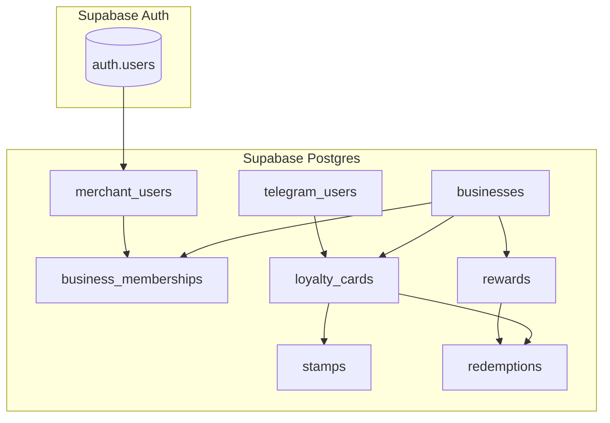

# Q-Loyal – Design Package

> It focuses exclusively on **architectural reasoning, API fitness, data modeling, operational concerns, and team structure**, as required by the assignment.

---

## 1. Architectural Requirements

### 1.1 Functional Requirements (System-Level)

These requirements describe **how the system must behave internally**, beyond the user flows already documented:

- Stamp issuance must be **atomic** (no partial updates between stamps and card balance)
- Stamp and reward actions must be **idempotent** (retry-safe)
- A loyalty card must be **unique per (customer, business)**
- All state-changing actions must be **auditable**
- Merchant actions must be **scoped strictly to their business**
- The system must support **future fraud and analytics signals** without redesign

---

### 1.2 Non-Functional Requirements

| Category | Requirement |
|-------|------------|
| Scalability | Support growth in merchants without architectural change |
| Performance | Sub-second response for scan + stamp path |
| Availability | Graceful failure and retry-safe APIs |
| Security | Strong tenant isolation and role-based permissions |
| Observability | Logs, metrics, and audit trails |
| Operability | Safe migrations, rollbacks, and dispute resolution |

---

## 2. Architectural Decisions & Trade-offs

### 2.1 Backend Architecture Style

**Chosen: Modular Monolith**

**Justification**
- Stamp issuance and redemption are **transactional, tightly coupled operations**
- Avoids distributed transactions and eventual consistency risks
- Simplifies debugging and operational overhead for MVP & Phase I

**Trade-off**
- Risk of growing complexity in a single codebase

---

### 2.2 Deployment Model

**MVP / Phase I**
- Single API service deployed via container or PaaS
- Stateless API design

**Phase I Extension**
- Optional async worker for:
  - Telegram notification retries
  - Scheduled reconciliation jobs
  - Background validation tasks

**Why not serverless**
- Cold starts and execution limits risk degrading scan experience
- Harder to debug transactional flows

---

## 3. API Design Package

### 3.1 API Paradigm Choice

**REST APIs**

**Reasons**
- Clear mapping to transactional resources
- Easy to document and audit
- Well-suited for idempotent command-style endpoints
- Avoids over-fetching/under-fetching risks of GraphQL for MVP

---

### 3.2 Representative API Endpoints

> Only **representative endpoints** are listed to demonstrate design fitness.

**Conventions**
- Base path: `/api/v1`
- Merchant endpoints require `Authorization: Bearer <JWT>`
- All mutating endpoints support `Idempotency-Key`

---

#### Resolve QR Payload  
POST `/loyalty/qr/resolve`

    { "qr_payload": "qloyal:user:uuid-user:v1:sig" }

Response:

    { "user_id": "uuid-user" }

---

#### Get or Create Loyalty Card  
POST `/loyalty/cards/get-or-create`

    { "business_id": "uuid-business", "user_id": "uuid-user" }

Response:

    { "card_id": "uuid-card", "total_stamps": 0, "created": true }

---

#### Issue Stamp  
POST `/loyalty/stamps`

    { "business_id": "uuid-business", "user_id": "uuid-user" }

Response:

    { "result": "stamp_added", "new_total_stamps": 7 }

Rejected example:

    {
      "error": {
        "code": "COOLDOWN_ACTIVE",
        "message": "Stamp recently issued"
      }
    }

---

#### Redeem Reward  
POST `/rewards/redeem`

    {
      "business_id": "uuid-business",
      "user_id": "uuid-user",
      "reward_id": "uuid-reward"
    }

Response:

    { "result": "approved", "new_total_stamps": 0 }

---

#### Audit Feed  
GET `/merchant/businesses/{business_id}/audit`

Response:

    {
      "events": [
        {
          "type": "STAMP_ADDED",
          "actor_id": "uuid-merchant",
          "timestamp": "..."
        }
      ]
    }

---

### 3.3 Authentication & Authorization

**Authentication**
- Customers: Telegram identity (`telegram_id`)
- Merchants: Supabase Auth + JWT

**Authorization**
- Roles: owner, employee, admin
- Enforcement layers:
  1. API permission checks
  2. Database Row Level Security (RLS)

**Why dual enforcement**
- API checks provide fast feedback.
- RLS prevents data leaks even if API logic fails.

---

## 4. Data Model & Storage

### 4.1 Database Choice

**PostgreSQL (via Supabase)**

**Reasons**
- Strong transactional guarantees.
- Relational integrity for cards, stamps, and redemptions.
- Native support for Row Level Security.
- Suitable for audit-heavy workloads.

**Rejected alternatives**
- MongoDB: weaker transactional semantics.
- DynamoDB: forces early access-pattern commitment.

---

### 4.2 Data Schema (MVP)

**Key constraints**
- One loyalty card per `(user, business)`.
- Stamps and redemptions are append-only.
- All writes produce audit events.

---

### 4.3 Data Access Patterns

**Write-heavy**
- Stamp issuance
- Reward redemption

Handled via database transactions with idempotency keys.

**Read-heavy**
- Card summaries
- Scan lookups
- Audit history

**Counters**
- `total_stamps` stored as cached value.
- Periodic reconciliation job planned for Phase I.

**Caching**
- MVP: none.
- Phase I: Redis for cooldowns, idempotency, and rate limits.

---

## 5. Implementation Team Proposal

### MVP Team Structure

**2 teams / 5 developers**

- **Core Backend (3)**
  - Schema & RLS
  - Stamp/redeem transactions
  - Validation & audit logic

- **Client Experience (2)**
  - Telegram bot
  - Merchant web UI

---

### Phase I Team Structure

**4 teams / 10–12 developers**

- Platform & Reliability
- Merchant Product
- Loyalty Core
- Trust & Insights (fraud & analytics)
