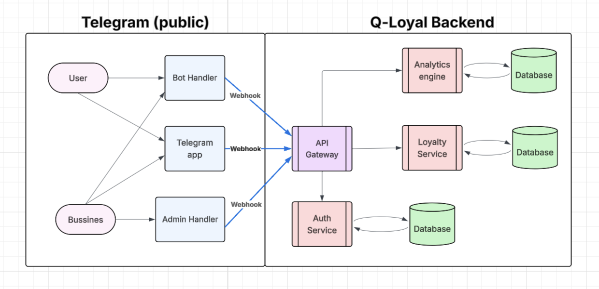
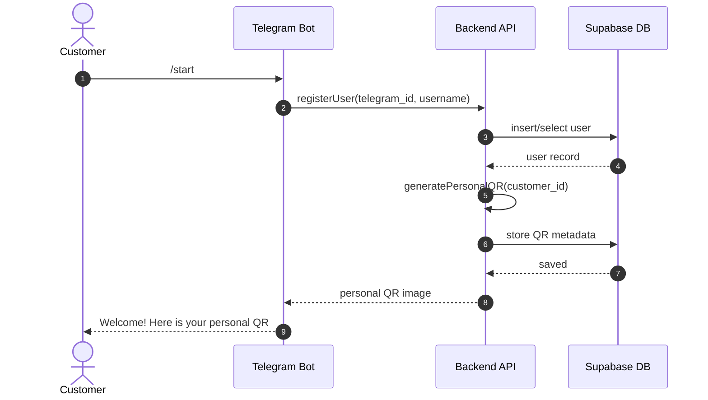
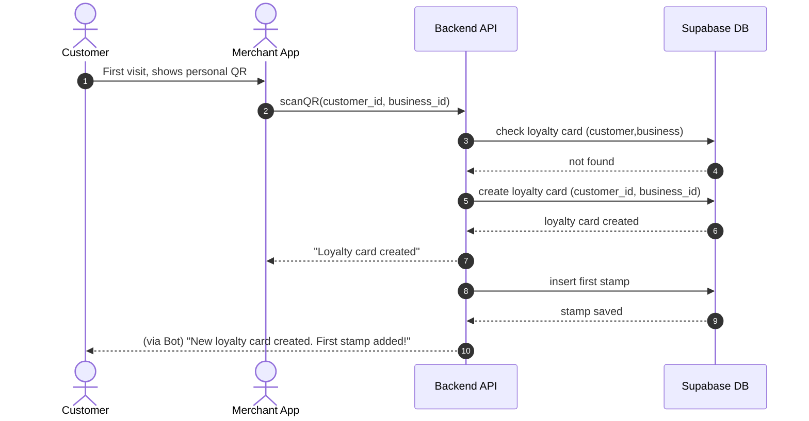
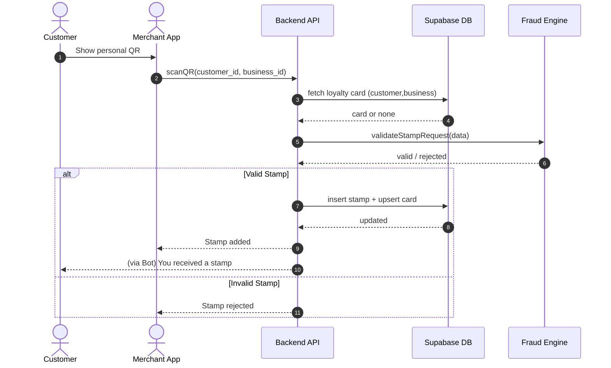
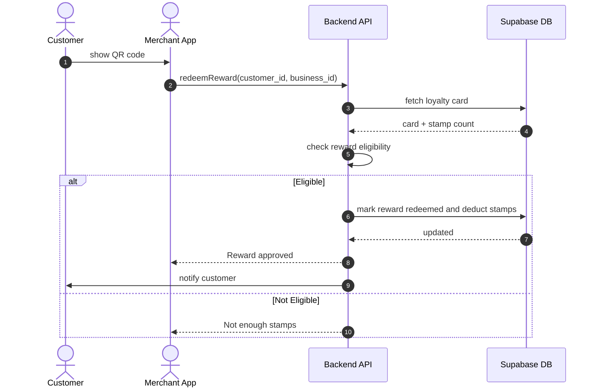

# Q-Loyal

Q-Loyal is a Telegram-based loyalty rewards platform that enables customers to collect digital stamps via QR codes and allows merchants to manage loyalty programs with minimal friction.

---

## Product Phases Overview

| Phase | Goal |
|------|-----|
| **MVP** | Validate core loyalty flow (QR -> stamp -> card) |
| **Phase I** | Make the product production-ready |
| **Phase II** | Optimize engagement, analytics, and trust |
| **Future Phases** | Scale, monetize, and integrate |

---

## Architecture Phase I/II

> This diagram includes **all MVP components plus the minimum additions required for a real-world release**.

### MVP Components
- Telegram Bot (customer interface)
- FastAPI Backend
- Supabase Database (PostgreSQL)
- QR Code generation & scanning
- Telegram-based identity (`telegram_id`)

### MVP Capabilities
- Customer onboarding
- Personal QR code generation
- Loyalty card creation
- Stamp issuance
- Stamp count tracking

## Phase I — Production Release

Phase I adds **operational safety, role separation, and observability**, while keeping the same core flows.

### Phase I Additions
- Merchant authentication (Supabase Auth)
- Role-based access (owner, employee)
- Web-based merchant dashboard (basic)
- Validation & rate limiting
- Logging & monitoring
- Deployment infrastructure

### Why Phase I Is Needed
- Prevent abuse
- Support real merchants
- Enable debugging & support
- Prepare for scale

## Core User Flows

### Customer Onboarding & Personal QR Creation

### Loyalty Card Creation

### Business Scans Customer QR to Add Stamp

### Reward Redemption Using Customer QR

## Phase II — Optimization & Growth

Phase II begins **only after real usage data exists**.

### Phase II Additions
- Merchant analytics dashboard
- Reward catalogs
- Redemption history
- Telegram notifications
- Fraud detection (velocity & behavior-based)
- Event tracking

### Signals to Enter Phase II
- Merchants request insights
- High stamp volume
- Repeated abuse attempts
- Drop in reward redemption

## Future Phases

These features are **intentionally deferred** until strong demand exists.

| Feature | Why | Trigger |
|------|----|----|
| Payments & subscriptions | Monetization | Merchants willing to pay |
| POS integrations | Scale | Larger merchants |
| Mobile merchant app | Convenience | Daily usage |
| ML fraud detection | Trust | High fraud cost |
| Cross-merchant rewards | Network effects | Dense merchant network |
| White-label solution | Enterprise | B2B demand |

## System Components

**Users**

- Customers
- Merchants
- Admins

**Clients**

- Telegram Bot
- Web Dashboard (Phase I)
- Merchant Portal (future)

### Architecture Patterns

- Layered / Clean Architecture
- Stateless API services
- Repository pattern
- Webhook-based integration (Telegram)
- Database-enforced authorization (RLS)