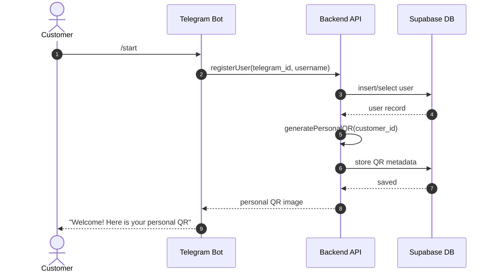

# Q-Loyal

A loyalty rewards platform that ingests customer transaction data from multiple merchants, and exposes APIs and dashboards for reward tracking, redemption, and partner management.

## Architecture

## 1. Elements of the Project

- **Telegram Bot** – main interface for customers, employees, and business owners.
- **FastAPI Backend** – business logic: QR validation, stamp issuance, user & business logic.
- **Supabase Database** – PostgreSQL + RLS for users, businesses, loyalty cards, stamps.
- **Supabase Auth** – auth system for business owners (and future web dashboard).
- **QR Code System** – static & dynamic QR codes for stamp collection and employee stamping.
- **(Future) Admin Dashboard** – web UI for business management and analytics.

## 2. Architectural Patterns
- **Layered / Clean Architecture**: API layer → service layer → repository layer → DB.
- **Webhook Integration**: Telegram → FastAPI via webhooks.
- **Repository Pattern**: DB access abstracted behind repositories.
- **Stateless API Services**: no server-side sessions; all state in DB.

## 3. Communication Between Components

- **Telegram Bot → FastAPI**  
  - Via Telegram **webhooks** for messages, commands, and QR scan events.
- **FastAPI → Supabase**  
  - Via Supabase client / SQL for CRUD on users, businesses, cards, and stamps.
- **Dashboard → FastAPI → Supabase** (future)  
  - Browser calls REST endpoints on FastAPI; backend queries Supabase.
- **QR Codes → FastAPI**  
  - QR payload is sent by the Telegram Bot to FastAPI, which validates and applies stamps.

## 4. Authentication (AuthN) & Authorization (AuthZ)

### Telegram Users (Customers & Employees)
- **AuthN**
  - Identified by `telegram_id` (Telegram as identity provider).
- **AuthZ**
  - Customers can only view and modify their own loyalty cards.
  - Employees can issue stamps only for cards belonging to their assigned business.

### Business Owners (Dashboard)
- **AuthN**
  - Supabase Auth (email/password or OAuth).
- **AuthZ**
  - Can only access and manage businesses where they are the owner.
  - Can manage employees and view analytics for their own businesses only.

### QR Codes
- **Static QR**
  - Encodes `business_id` for simple “add stamp” flows.
- **Dynamic QR**
  - Encodes `business_id`, `employee_id`, and a nonce/timestamp to prevent replay.
- Validation & permissions checks happen in FastAPI.

### Database-Level Enforcement
- **RLS Policies in Supabase**
  - Restrict access by:
    - `telegram_user_id` for customer data (cards, stamps).
    - `owner_id` for business and analytics data.
    - `employee_id` and `business_id` for stamp issuance.

**Users**

- Customers
- Merchants
- Admins

**Clients**

- Web Dashboard
- Mobile App
- Merchant Portal

**Public Services**

- Customer API
- Merchant API + Analytics

**Internal Services**

- Public Auth (Customers & Merchants)
- Internal Auth (Admins)
- Reward Calculation Engine
- Notification Service
- Reporting Service

**3rd Party Services**
- Email Service (SendGrid/SES)